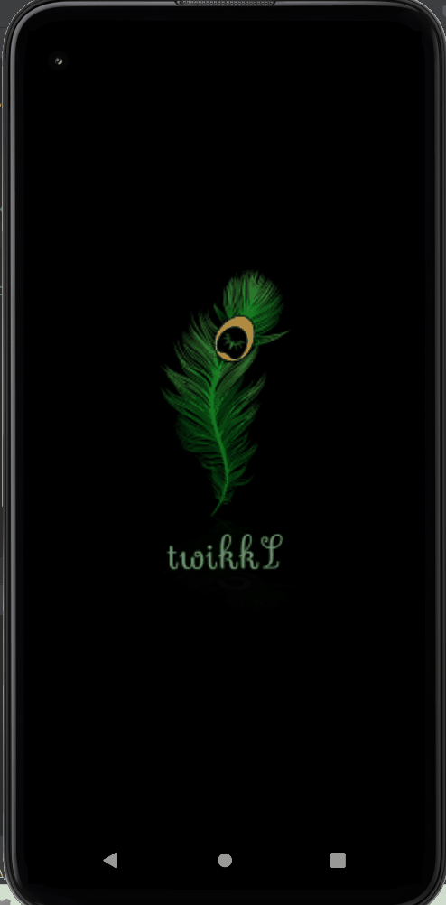

<div style="text-align: center; align-self: center" >
    
</div>

## Intro

Welcome ! This is the place to get started with **TwikkL** app. We introduce you to the very interesting topics and
aspects. Also, we give support to mobile dev community to learn.

This app is intended to be a cross-platform
[_DApp_](https://www.investopedia.com/terms/d/decentralized-applications-dapps.asp)
(for Android and iOS), that makes live-streaming, record, share videos and provide services.

NOTE:  
If you are an experienced person and want to give us your support or point of view or if you are a beginner who would
like to ask some questions feel free to contact us in [Discussion](/) window.

## Demo:
This following demo animated image, represents the actual version of the app. Yes, it's still new 🤣
<details>
  <summary>Expand 👈</summary>

</details>

## Getting started

Before you start make sure that you have at least ~15 minutes ⏱ to set up your dev environment.

### Tech stack:

The most important techs used in this app are :

1. React v18
2. Expo v48 (Managed)
3. React Native v0.71
4. React Native Paper v5 (UI library)

NOTE:  
Don't worry if you don't know few of these, it's fine 😅. But if all of these are totally new to you, then we recommend
you to learn some basics. If so, we suggest you to follow the [React Native basics guide](https://reactnative.dev/docs/getting-started)

Next, make sure to install the following tools on your local machine and Os:

1. Node.js (We recommend LTS version higher than v16 )
2. A JavaScript IDE such as VsCode, Webstorm etc...
3. Git (visit [the GitHub's guide on how to set up Git](https://docs.github.com/en/get-started/quickstart/set-up-git))

You can run the app directly on your own device by using Expo Go App (available on Android and iOS), it makes you run 
the app directly on a physical device.
But if you want to use emulator or iOS simulator, we recommend you to visit the following link:
1. [Expo: Setting up Android emulator](https://docs.expo.dev/workflow/android-studio-emulator/)
2. [Expo: Setting up iOS simulator](https://docs.expo.dev/workflow/ios-simulator/)

If you want to run the app on web navigator like Chrome or Mozilla, then you'll have to [add few additional dependencies](https://docs.expo.dev/workflow/web/).

### Deploy the app locally

Once you're ready with the tools mentioned above, you can import source code using Git CLI with the following command:

```
git clone https://github.com/JiggyDevs/twikkl-app.git
```

Next, install the app using npm:``npm install`` OR yarn: ``yarn install``.

Once it's done, run the following command from project root directory:

```
npx expo start
```

NOTE: If you're looking to contribute, then you'll have to **fork** the repo then send your Pull request(s) (check the GitHub ["Creating a pull request from a fork" guide](https://docs.github.com/en/pull-requests/collaborating-with-pull-requests/proposing-changes-to-your-work-with-pull-requests/creating-a-pull-request-from-a-fork)).

## Styling
The styling integration must follow the design prototype, which is currently exposed as few images under [/docs/design-images](/) folder.

We are actually working on a way to provide full design sources to you via one click 😉.

Also, notice the theme setup under [`/configs/theme.ts`](/), this configuration is made following [React Native Paper theming guide](https://callstack.github.io/react-native-paper/docs/guides/theming/).

Finally, as for the icons, we use [IcoMoon](https://icomoon.io/) tool to generate our own icon-set. 

